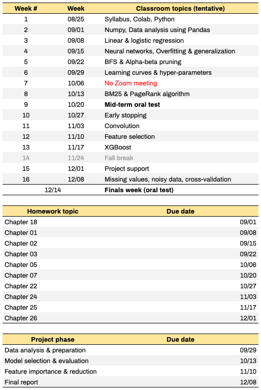

## Syllabus of Artificial Intelligence (CMPSCI 4300/5300) - 2020 Fall

## A. Class and office hours
* Instructor: [Badri Adhikari](http://umsl.edu/~adhikarib/)
* Email: [adhikarib@umsl.edu](mailto:adhikarib@umsl.edu)
* Class meets: `TR 12:30PM - 1:45PM` (synchronously via Zoom)
* Office hours: I will be available for up to 30 minutes after each class to answer your questions. If this time does not work for you, please email me and we can find a time that works for you and me.

## B. About the course (Official course description)
* This course provides an introduction to artificial intelligence (AI). The list of topics may include artificial neural networks, search, planning, knowledge-based reasoning, probabilistic inference, machine learning, natural language processing, and practical applications. \[3 credit units\].

## C. Prerequisites  
* CMPSCI 3130 (Design and Analysis of Algorithms) or Graduate Standing in CS

## D. Learning outcomes  
I teach this course differently. Although I cover the book's chapter topics, the focus of the course is on the [ToDo: activities](). The activities are the heart of the course. I believe that you will learn more from the lectures when you watch them at home. So, I have recorded the chapter lectures for you to watch at home. During class, we will focus on activities. I will provide you the technical support you need to complete the activities. We all learn more by `doing` and this is exactly what we will do in this course. Below are the learning outcomes:
* Use Python, Numpy and Keras to design, train, and evaluate basic feed-forward neural networks
* Learn artificial intelligence principles and approaches
* Learn a basic understanding of the building blocks of AI as presented in terms of intelligent agents
* Evaluate various searching algorithms
* Understand problems and ideas in the field of natural language processing, perception, and robotics
* Learn the philosophical foundations of AI and the future of AI
* Implement various AI algorithms such as depth-first search, and breadth-first search.

## E. Textbook  
Artificial Intelligence: A Modern Approach (3rd Edition) by [Pearson](https://www.pearson.com/us/higher-education/product/Russell-Artificial-Intelligence-A-Modern-Approach-3rd-Edition/9780136042594.html).

## F. Course topics
- **Book chapters**  
  - Chapter 18 - Learning From Examples 
  - Chapter 1 - Introduction 
  - Chapter 2 - Intelligent Agents
  - Chapter 3 - Solving Problems by Searching 
  - Chapter 5 - Adversarial Search
  - Chapter 7 - Logical Agents
  - Chapter 22 - Natural Language Processing
  - Chapter 24 - Perception 
  - Chapter 25 - Robotics
  - Chapter 26 - Philosophical Foundations  
- **Machine learning using Tensorflow**   
  - Basics of Python, Numpy and Keras
  - Design, train, and evaluate basic feed-forward neural networks
  - Study feature importance and feature reduction

## G. Course materials  
* All course materials are inside the relevant folders in Github location
* Recorded lectures of the chapters are [here](./LECTURES.md)
 
## H. Course schedule

## I. General policies
* Keep yourself out of plagarism; Read [UMSL's Policy](https://www.umsl.edu/services/academic/policy/academic-dishonesty.html); Our `turnitin` tool automatically checks for plagarism; Here is an [example](supporting_files/turn-it-in.png).
* Lecture recordings, audio or video, are not permitted.

## J. Programming language
* Python3 is language for the course; you are expected to use Python3 for all of your classroom activities, homeworks, and project.
* You are also required to use [Google colab](https://colab.research.google.com) or your own hosted Jupyter Notebook for running your programs.

## K. Due dates and late policy  
* Homeworks and project phases have their respective due dates (see Schedule).
* All activities will be graded at the end of the semester (i.e. no immediate due dates). You can resubmit activities as many times as you want. Your most recent submission will be graded.
* You can request a maximum two-day extension on any homeworks or project submissions - for up to two submissions. 
* If you email me a few hours before a deadline and I don't reply you immediately, and if you have not used your two-day extensions, you can assume that the extension is granted automatically.
* Once you use your extension days, late submissions will get no points.

## L. Course project
* See [here](PROJECT.md).

## M. Classroom activities
* See [here](activities/README.md).

## N. Homeworks
There will be two types of homeworks:  
1. Writing chapter summaries, and 
2. Project phases (see [ToDo: project]())

### Chapter summary homeworks
The homework here is to write a 1000 words summary of each chapter after watching the [ToDo: recorded lectures](). Please see the course schedule above for submission deadlines.
1. Your summary should be at least 1000 words (at least 1500 words for graduate students) of `plain text`.
1. All text must be `in your own words` and anything copied must be quoted and cited appropriately.
1. Your summary should not be all bullets, use bullets only when appropriate.
1. Your chapter summary must be divided into the [ToDo: topics of the chapter](). For example, the summary on the chapter `Preception` should have the corresponding four sections.
1. All homeworks will be automatically checked for plagarism using the Canvas plugin Turnitin. If you copy/paste contents from the Internet, you will receive a `zero` for your submission. Serious actions will be taken for any repeated plagarism.

## O. Oral tests
The mid-term and finals for this course will be in the form of oral tests, via Zoom one-on-one meetings. Each meeting may be up to 30 minutes longAlthough some oral questions may check your understanding of the concepts, questions on the oral test will mostly focus on the details. Questions in the oral test will be from your own submissions - homeworks, activities, and project submissions. I will randomly pick one of your submissions, and ask you some details. Some students who have done exceptionally well may be exempt from the oral test. I will send an email to you if you are exempt, you cannot email and ask to be exempt. Closer to the mid-term and finals week, you will be able to sign-up to select a time that works for you. Here are two example questions:
1. In your homework number 3, in paragraph 5, you discuss X and Y. Please mention the purpose of X.
1. In your activity 10 submission's Notebook, please explain why you wrote the codes in line number 6.

## P. Attendance
* Attendance will be recorded sometimes.
* Uninformed missing of three consecutive classes in a row may lead to failing the course.

## Q. Grade composition  
* 8 chapter summaries * 2 = 16 points
* 3 project phases * 6 = 18 points
* 1 final project report * 12 = 12 points
* 20 activities * 1 = 20 points
* 2 oral tests * 17 = 34 points 
* 1 bonus point to everyone who complete the course evaluation survey (please email me once you submit the survey)

## R. Grading scheme  
   

## S. Resources
* [Resources & Support](https://umsl.instructure.com/courses/44471/pages/student-resources-and-supports?module_item_id=454221)
* [Technology Assistance](https://umsl.instructure.com/courses/44471/pages/technology-assistance?module_item_id=454223)

