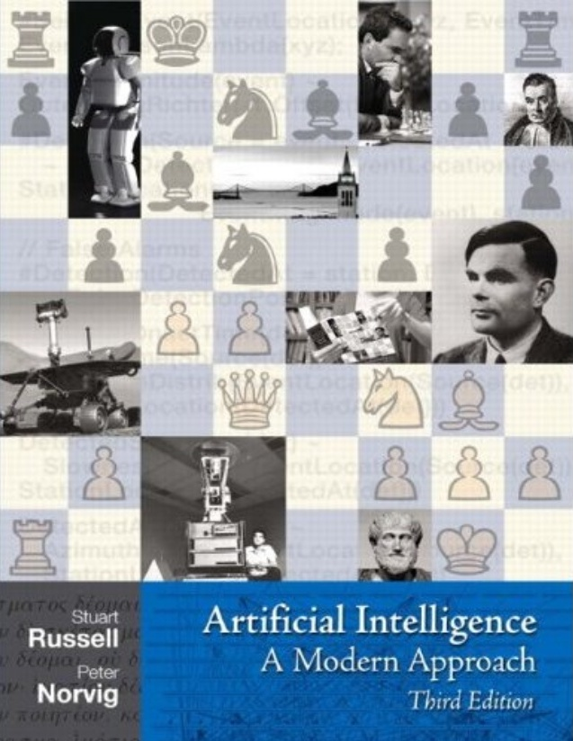
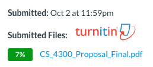

## Artificial Intelligence - CMP SCI 4300/5300
## Syllabus - 2020 Spring

[Academic Calendar](https://www.umsl.edu/services/academic/publications/calendar/academic%20calendar%202019-2020.pdf) | [Resources & Support](https://umsl.instructure.com/courses/44471/pages/student-resources-and-supports?module_item_id=454221) |  [Technology Assistance](https://umsl.instructure.com/courses/44471/pages/technology-assistance?module_item_id=454223) | [Final Exam Schedule](https://www.umsl.edu/~registration/final-exams.html)

## About the Instructor
* Name: Badri Adhikari
* Email: adhikarib@umsl.edu
* Office Hours: Mondays 1 PM to 4 PM
* Office Location: 312 ESH
* Homepage: [https://badriadhikari.github.io](https://badriadhikari.github.io)

## About the Course
* This course provides an introduction to artificial intelligence (AI). The list of topics may include artificial neural networks, search, planning, knowledge-based reasoning, probabilistic inference, machine learning, natural language processing, and practical applications. \[3 credit units\].

### Prerequisites  
* CMP SCI 3130 (Design and Analysis of Algorithms) or Graduate Standing in CS

### Learning Outcomes  
* Use Python, Numpy and Keras to design, train, and evaluate basic feed-forward neural networks
* Learn an overview of artificial intelligence principles and approaches
* Learn a basic understanding of the building blocks of AI as presented in terms of intelligent agents
* Select and evaluate various searching algorithms
* Understand some of the problems and ideas in the field of natural language processing, perception, and robotics
* Learn the philosophical foundations of AI and the future of AI
* Implement various AI algorithms such as DFS, BFS, etc.

### Class meets  
* MW 4:00 AM - 5:15 PM at Clark Hall 307

### Course Materials  
Slides, Homeworks, Project, Tests, and Test Samples are inside the relevant folders at the Github location - https://github.com/badriadhikari/2019-Fall-AI/

### Textbook  
Artificial Intelligence: A Modern Approach (3rd Edition)     

## Course Topics
### Book chapters
**Chapter 18 - Learning From Examples**   
**Chapter 1 - Introduction**  
**Chapter 2 - Intelligent Agents**  
**Chapter 3 - Solving Problems by Searching**  
**Chapter 5 - Adversarial Search**  
**Chapter 6 - Constraint Satisfaction Problems**
**Chapter 7 - Logical Agents**  
**Chapter 22 - Natural Language Processing**  
**Chapter 24 - Perception**  
**Chapter 25 - Robotics**  
**Chapter 26 - Philosophical Foundations**  
### Machine learning using Keras
**Basics of Python, Numpy and Keras**
**Design, train, and evaluate basic feed-forward neural networks**
**Study feature importance and feature reduction**

## Course Schedule
| `Week` | `Date` | `Topic` | 
| --- | --- | --- | 
| 01 | W/01/22 | Syllabus + Github + Kaggle + Colab |
| 02 | M/01/27 | `Activity:` Python |
| 02 | W/01/29 | `Activity:` Numpy |
| 03 | M/02/03 | `Activity:` Pandas |
| 03 | W/02/05 | **`Test01:`** - Python & Numpy |
| 04 | M/02/10 | `Activity:` Univariate linear regression |
| 04 | W/02/12 | `Activity:` Linear Regression with Two Input Variables |
| 05 | M/02/17 | `Activity:` Logistic Regression |
| 05 | W/02/19 | **`Test02:`** Ch18 - Learning from examples + `Discussion:` [Basics of Neural Networks](http://jalammar.github.io/visual-interactive-guide-basics-neural-networks/) |
| 06 | M/02/24 | `Activity:` Binary classification using Keras |
| 06 | W/02/26 | **`Test03:`** Ch01 & Ch02 - Introduction to AI + `Discussion:` Evaluating binary classifier |
| 07 | M/03/02 | `Activity:` Implement BFS |
| 07 | W/03/04 | **`Test04:`** Ch03 - Problem solving + `Discussion:` Project proposal |
| 08 | M/03/09 | `Activity:` Practice alpha-beta pruning algorithm |
| 08 | W/03/11 | **`Test05:`** Ch05 - Adverserial search + `Activity:` Regression using Keras  |
| 09 | M/03/16 | `Activity:` Evaluating real-valued predictions |
| 09 | W/03/18 | **`Test06`** Ch06 - Constraint satisfaction problems |
| - | - | Spring break |
| - | - | Spring break |
| 11 | M/03/30 | Discussion: Peer-review of project notebooks |
| 11 | W/04/01 | Activity: Decision tress and XGBoost |
| 12 | M/04/06 | **`Test07`** Ch07 - Logical agents + Activity: Feature Importance using XGBoost + Activity: Overfitting vs generalization using decision trees |
| 12 | W/04/08 | **`Test08:`** Ch22 - NLP + Activity: Ov vs Ge using NN |
| 13 | M/04/13 | Activity: Peer-review of proposals |
| 13 | W/04/15 | **`Test09:`** Ch24 - Perception + Activity: Implement BM25 |
| 14 | M/04/20 | Activity: Feature importance and reduction |
| 14 | W/04/22 | **`Test10:`** Ch25 - Robotics + Activity: Implement Pagerank |
| 15 | M/04/27 | Activity: Code a function of NN model |
| 15 | W/04/29 | **`Test11:`** Ch26 - Philosophical foundations + Activity: Implement convolution |
| 16 | M/05/04 |  |
| 16 | W/05/06 |  |
| - | May 11, Mon | **`Final Exam` - 2:45 PM to 4:45 PM at Clark Hall 307** |  

## Course Policies

### General Policies
* Keep yourself out of plagarism; Read [UMSL's Policy](https://www.umsl.edu/services/academic/policy/academic-dishonesty.html); Our 'turnitin' tool automatically checks for plagarism
    
* Lecture recordings, audio or video, are not permitted
* You are welcome to bring your laptop in class

### Late Homework/Project Submission  
* You have a total of 5 late days
* Once you use your late days, late submissions will get no points

### Projects
Please see the 'project' folder.

### Homeworks
Please see the 'homeworks' folder.

### Tests 
* There will be two tests including one final (see the schedule for dates)
* Test will be CLOSED book, CLOSED notes, and CLOSED electronics
* Use of any type of electronics is strictly forbidden during tests

### Attendance  
* Attendance will be recorded in every class
* More than 5 uninformed absenses will lead to failing the course

## Assessment/Grading

### Grade Composition  
* 10 points = Homeworks
* 30 points = Test 1 and Test 2
* 10 points = Project Proposal (with review comments)
* 10 points = Initial Report (with review comments)
* 5 points = Peer-review of proposals
* 5 points = Peer-review of initial reports
* 10 points = Project Poster Presentation
* 20 points = Final Report  
* 1 bonus point to everyone in the class if 80%+ complete the course evaluation survey

### Grading Scheme  
| Grade | Points |  | Grade | Points |   | Grade | Points | 
| --- | --- | --- | --- | --- | --- | --- | --- | 
| A | 100% to 94% | | B- | <84% to 80% | | D+ | <70% to 67% |
| A- | <94% to 90% | | C+ | <80% to 77% | | D | <67% to 64% |
| B+ | <90% to 87% | | C | <77% to 74% | | D- | <64% to 61% |
| B | <87% to 84% | | C- | <74% to 70% | | F | <61% to 0% |

