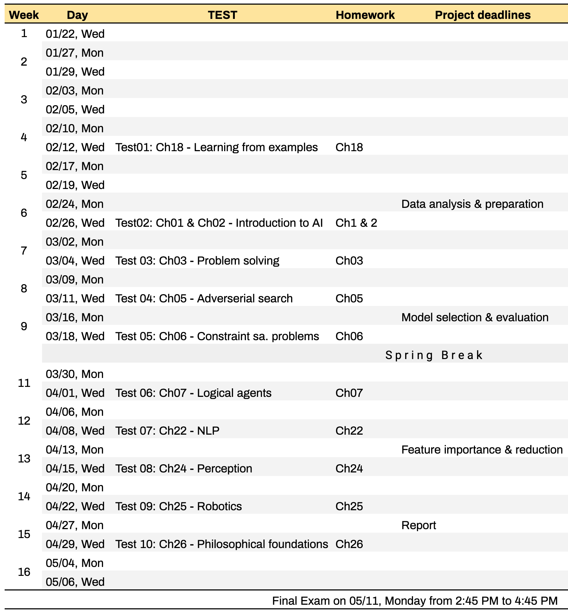

## Syllabus of Artificial Intelligence (CMPSCI 4300/5300) - 2020 Spring

[Academic Calendar](https://www.umsl.edu/services/academic/publications/calendar/academic%20calendar%202019-2020.pdf) | [Resources & Support](https://umsl.instructure.com/courses/44471/pages/student-resources-and-supports?module_item_id=454221) |  [Technology Assistance](https://umsl.instructure.com/courses/44471/pages/technology-assistance?module_item_id=454223) | [Final Exam Schedule](https://www.umsl.edu/~registration/final-exams.html)

## Class and office hours
* Instructor: [Badri Adhikari](https://badriadhikari.github.io) | [adhikarib@umsl.edu](mailto:adhikarib@umsl.edu)
* Class meets: `MW 4PM to 5:15PM` at `ESH 103`
* Office location and hours: `312 Express Scripts Hall`, `Mondays 1PM to 4PM` 

## About the course
* This course provides an introduction to artificial intelligence (AI). The list of topics may include artificial neural networks, search, planning, knowledge-based reasoning, probabilistic inference, machine learning, natural language processing, and practical applications. \[3 credit units\].

## Prerequisites  
* CMPSCI 3130 (Design and Analysis of Algorithms) or Graduate Standing in CS

## Learning outcomes  
* Use Python, Numpy and Keras to design, train, and evaluate basic feed-forward neural networks
* Learn an overview of artificial intelligence principles and approaches
* Learn a basic understanding of the building blocks of AI as presented in terms of intelligent agents
* Select and evaluate various searching algorithms
* Understand some of the problems and ideas in the field of natural language processing, perception, and robotics
* Learn the philosophical foundations of AI and the future of AI
* Implement various AI algorithms such as DFS, BFS, etc.

## Course materials  
All course materials are inside the relevant folders in Github location.

## Textbook  
Artificial Intelligence: A Modern Approach (3rd Edition) by [Pearson](https://www.pearson.com/us/higher-education/product/Russell-Artificial-Intelligence-A-Modern-Approach-3rd-Edition/9780136042594.html). 

## Course topics
- **Book chapters**  
  - Chapter 18 - Learning From Examples 
  - Chapter 1 - Introduction 
  - Chapter 2 - Intelligent Agents
  - Chapter 3 - Solving Problems by Searching 
  - Chapter 5 - Adversarial Search
  - Chapter 6 - Constraint Satisfaction Problems
  - Chapter 7 - Logical Agents 
  - Chapter 22 - Natural Language Processing
  - Chapter 24 - Perception 
  - Chapter 25 - Robotics 
  - Chapter 26 - Philosophical Foundations  
- **Machine learning using Keras**   
  - Basics of Python, Numpy and Keras
  - Design, train, and evaluate basic feed-forward neural networks
  - Study feature importance and feature reduction

## Course schedule

Detailed course schedule is [here](https://docs.google.com/spreadsheets/d/e/2PACX-1vRF6jdD5-whvlX-1mbKLpnryHVr8dIcKUbJcfg-Kx6WH7PkiXNRgLwyaQFO8svZWfxtaccjYpef0mpm/pubhtml).

## General policies
* Keep yourself out of plagarism; Read [UMSL's Policy](https://www.umsl.edu/services/academic/policy/academic-dishonesty.html); Our `turnitin` tool automatically checks for plagarism; Here is an [example](supporting_files/turn-it-in.png) 
* Lecture recordings, audio or video, are not permitted
* You are welcome to bring your laptop in class

## Programming language
* Python3 is language for the course; you are expected to use Python3 for all of your classroom activities, homeworks, and project.
* You are also required to use [Google colab](https://colab.research.google.com) or your own hosted Jupyter Notebook for running your programs.

## Late policy  
* You have a total of 5 late days.
* Once you use your late days, late submissions will get no points.

## Course project
Project and requirements are described [here](PROJECT.md).

## Homeworks
* There will be two kinds of homeworks: 1) writing chapter summaries, and 2) project milestones.
* What to submit? One page summary (at least 500 words) of the chapter.

## Tests 
* There will be short tests (maximum 30 minutes) almost every week on Wednesdays (see the course schedule).
* If you miss a test (on topic A) and send me an email by the end of next day with a valid reason, your score in the next test (on topic B) will be copied as your score for the test you missed. However, in the test that you appear, you may be asked questions from both topics (A and B) while all others will receive questions only on topic B.
* Tests will be CLOSED book, CLOSED notes, and CLOSED electronics.
* Use of any type of electronics is strictly forbidden during tests.

## Attendance  
* Attendance will be recorded frequently
* More than 5 uninformed absenses may lead to failing the course

## Grade composition  
* 10 * 3 points = 10 Tests
* 10 * 1 points = 10 Homeworks
* 20 * 1 points = 20 Activities
* 40     points = Project
* 1.5 bonus point to everyone in the class if 80%+ complete the course evaluation survey

#### Project (40 points)
* 10  points = Data analysis & preparation
* 10  points = Model selection & evaluation
* 5  points = Feature importance and reduction
* 5  points = Addressing peer-reviews
* 10 points = Poster presentation (score from external judges, peers, and instructor)

## Grading scheme  

