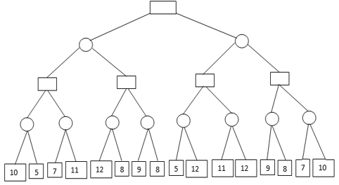
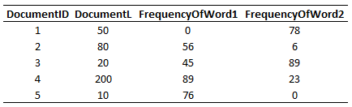
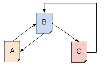
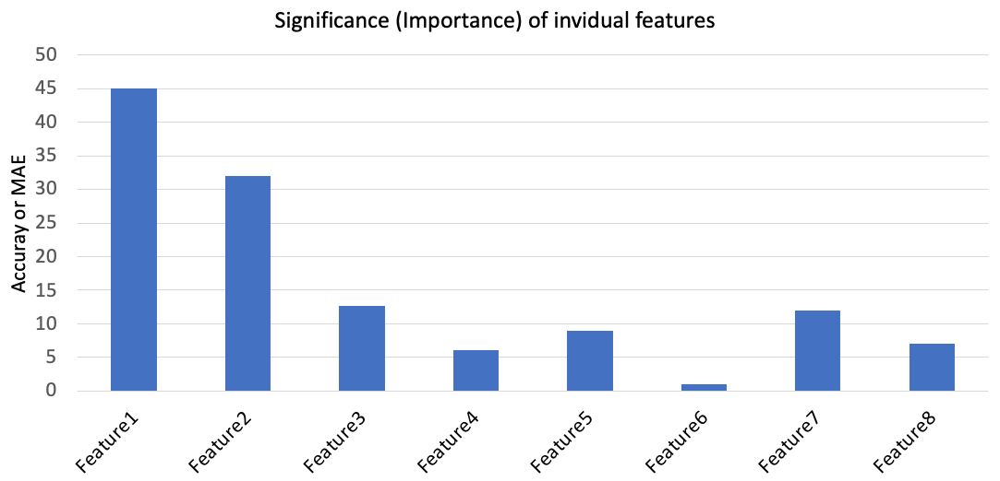

**Tip**: When opening .ipynb files if you get **`Sorry,... Reload?`** error in Github, use **[https://nbviewer.jupyter.org/](https://nbviewer.jupyter.org/)**  

# Classroom activities
* There will be 25+ classroom activities for you to participate.
* Each activity is worth 1 point.
* You will need to complete at least 20 activities in order to receive full points. If you complete more than 20 activities, you will receive a bonus point for each activity you complete.
* The only way to receive points on activities is to present your completed activity to the instructor during the class.

--------------  

## 1. Python
* Watch how to use [Google Colab](https://www.youtube.com/watch?v=PVsS9WtwVB8)
* Practice Python3 - [notebook](../notebooks/python.ipynb) and watch [lecture](https://www.youtube.com/watch?v=V42qfAPybp8)

## 2. Numpy, Matplotlib
* Practice Numpy - [notebook](../notebooks/numpy.ipynb) and [lecture](https://www.youtube.com/watch?v=Omz8P8n-5gY)
* Practice Matplotlib & Plotly - [notebook](../notebooks/matplotlib_plotly.ipynb) and [lecture](https://youtu.be/aIzkkjRzVdA)

## 3. Basic data analysis using Pandas
* Practice Pandas - [notebook](../notebooks/pandas.ipynb)
* Find a dataset of your choice at [kaggle.com](https://kaggle.com/) and repeat your analysis for the dataset you downloaded

## 4. Univariate linear regression (Chapter 18)
* Practice univariate linear regression - [notebook](../notebooks/Univariate_linear_regression.ipynb)
* Learn to normalize data - [notebook](../notebooks/normalization_techniques.ipynb)
* Find a dataset of your choice at [kaggle.com](https://kaggle.com/)
* From this dataset, select two variables (one input and one output) and perform univariate linear regression
  - Check that the variables you select are continuous

## 5. Linear regression with two input variables (Chapter 18)
* Practice linear regression with two input variables - [notebook](../notebooks/Linear_regression_2_inputs.ipynb)
* Find a dataset of your choice at Kaggle
* From this dataset, select three variables (two input and one output) and perform regression
  - Check that the variables you select are continuous

## 6. Logistic regression (Chapter 18)
* Practice logistic regression - [notebook](../notebooks/Logistic_regression.ipynb)
* Find a classification dataset of your choice at Kaggle
* From this dataset, select three variables (two input and one output) and perform regression
  - Check that the output variable is binary

## 7. Binary classification using NN
* Group discussion of "[A Visual and Interactive Guide to the Basics of Neural Networks](http://jalammar.github.io/visual-interactive-guide-basics-neural-networks/)"
* Practice binary classification - [notebook](../notebooks/Binary_classification.ipynb)
* Find a classification dataset of your choice at Kaggle
  - Check that the output variable is binary
  - Evaluate your model using accuracy, precision, and recall
  - Build a binary NN classifier for your dataset
  - Build a logistic regression model and observe the accuracy, i.e. compare the performance of the neural network with a logistic regression model
  - What is the baseline accuracy?

## 8. Breadth-first search (BFS) tree (Chapter 3)
1. Study and discuss the BFS algorithm.   
   
1. Study and discuss the BFS tree below.   
   
1. Here is a map of some international airports in India. Nick wants to go to Amritsar from Chennai (see the map). IN PAPER, draw a BFS tree for the graph of airport cities with starting node as Chennai (C).  
   

## 9. Implement the breadth-first search (BFS) algorithm (Chapter 3)
* Implement the BFS algorithm (in Python) to find the shortest path from Sibiu to Bucharest in this map.  
      
* Queues in Python:
  ```Python
  # Initializing a queue 
  queue = []  
  # Adding elements to the queue 
  queue.append('a') 
  queue.append('b') 
  queue.append('c') 
  # Print
  print(queue) 
  # Removing elements from the queue 
  print("\nElements dequeued from queue") 
  print(queue.pop(0)) 
  print(queue.pop(0)) 
  print(queue) 
  ```
* Representing a graph using dictionary (values are lists of neighbors):
  ```
  graph = {} 
  graph['A'] = ['B', 'C']
  graph['B'] = ['A', 'D', 'E']
  ```

## 10. Regression using NN and evaluation
* Practice regression using neural networks - [notebook](../notebooks/Regression_NN.ipynb)
* Find a regression dataset of your choice at kaggle; make sure that the output variable is continuous real-valued
* On your new dataset, do the following:
  1. Train a regression neural neural network model
  1. Compare the MAE of your model with MAE of a linear regression model (only 1 layer)
  1. Is your model biased? i.e. in your true/prediction plot does your model predict smaller values more correctly or larger values more correctly?
  1. Which is the best loss function for your output variable? mae, mse, mean_squared_logarithmic_error, or logcosh?

## 11. Overfitting vs generalization
1. Find a dataset of your choice at Kaggle. Classification or regression, any.
1. Shuffle the rows
   ```python
   # Shuffle
   import random
   np.random.shuffle(dataset)
   ```
1. Split into training and validation set. For small datasets, ~30% works. For larger datasets, smaller percents can be enough.
   ```python
   # Index for 30%
   index_30percent = int(0.3 * len(dataset[:, 0]))
   print(index_30percent)
   # Split into training and validation
   XVALID = dataset[:index_30percent, "all input columns"]
   YVALID = dataset[:index_30percent, "output column"]
   XTRAIN = dataset[index_30percent:, "all input columns"]
   YTRAIN = dataset[index_30percent:, "output column"]
   ```
    
1. If you are normalizing your data, only use the XTRAIN and YTRAIN to obtain the normalization parameters (mean/std). Do not use XVALID or YVALID.
1. Build a NN model to overfit the training set (to get ~100% accuracy or ~0.0 MAE) and then evalute on the validation set and observe the accuracy/MAE
   1. Learn the model from training set
      ```python
      model.fit(XTRAIN, YTRAIN, ...)
      ```
   1. Evaluate on XTRAIN
      ```python
      P = model.predict(XVALID)
      MAE = abs(YTRAIN - P)
      ```
   1. Normalize XVALID and YVALID using the mean/std/Ymax obtained from XTRAIN/YTRAIN
   1. Predict for validation set and evaluate
      ```
      P = model.predict(XVALID)
      MAE = abs(YVALID - P)
      ```
   1. Plot true vs prediction plots for sets (training and validation) and compare the plots
1. Answer the following questions:
   1. Does your model perform better on the training set or validation set? Is this a problem? How to avoid this problem?
   1. Why can over-training be a problem?
   1. What is "generalization"?
   1. What is over-fitting?
   1. Why should you not use XVALID/YVALID during normalization?

## 12. Alpha-beta pruning (Chapter 5)
* This is not a programming activity, you will solve it in paper.
* For the following game tree, (a)show which nodes/sub-tree will be pruned by the Alpha-Beta pruning algorithm, and (b) calculate the minimax values (the output of MAX-VALUE or MIN-VALUE) for the non-leaf nodes. 
  
 
## 13. Learning curves
1. Read [this](https://machinelearningmastery.com/learning-curves-for-diagnosing-machine-learning-model-performance/) blog about learning curves.
1. Find a dataset of your choice (regression or classification) at Kaggle. Shuffle it, split it, and train a model.
1. Obtain learning curves for your dataset
   ```python
   # Do the training (specify the validation set as well)
   history = model.fit(XTRAIN, YTRAIN, validation_data=(XVALID, YVALID), ...)
   # Check what's in the history
   print(history.params)
   # Plot the learning curves (loss/accuracy/MAE)
   plt.plot(history.history['loss']) # replace with accuracy/MAE
   plt.plot(history.history['val_accuracy']) # replace with val_accuracy, etc.
   plt.ylabel('Accuracy')
   plt.xlabel('epoch')
   plt.legend(['training data', 'validation data'], loc='lower right')
   plt.show()
   ```
1. Using your dataset, produce the learning curves that represent the following cases:
   1. too small validation dataset (relative to training set)
   1. too small training set (relative to validation set)
   1. a good learning curve (practically good)
   1. an overfitting model
   1. a model that clearly requires further training
   1. an underfit model that does not have sufficient capacity (also may imply that the data itself is difficult)
1. Interpret the following learning curve:   
   

## 14. Fine-tuning hyper-parameters of your model
* Find a dataset of your choice at Kaggle
  * It can your project dataset
* Split into training and validation set
* Your goal is to find the optimal hyper-parameters that maximize the accuracy (or minimize MAE) on the validation set
  You can try the following:
  * Increase the number of layers
  * Increasing the number of neurons in each layer
  * Study how the number of layers and number of neurons in each layer affect the model's performance on validation set
* Verify that the number of parameters in your model is optimal
  * Show that two different models with slightly smaller parameters do not perform as good
  * Show that two different models with slightly larger parameters do not perform as good
* Why are the parameters such as #of neurons, #of layers, #of epochs, batch size, activation functions, etc. call hyper-parameters and not just parameters?

## 15. Implement BM25 algorithm (Chapter 22)
* A search query “Word1 Word2” is being scored against the following documents (see table). The document corpus (as shown in the table) only contains five documents.
* The number of times the words “Word1” and “Word2” appear in each of the documents is given in the table. The length of each document is also given. Assume k = 1.2 and b = 0.75.
* Write a program to calculate the BM25 score for the query against all the documents and rank the documents by their BM25 score. Your program should read the table from a file, i.e. do not hardcode these values into your program. You may hardcode the values of k and b, but compute IDF, DF, TF, N, L, etc. using the data you read from the text file, at runtime.
* The scores you will obtain will range from -2.3 to -4.8. Note: You may get negative scores because of N being close to DF - you can read more [here](https://en.wikipedia.org/wiki/Okapi_BM25).  


## 16. Implement PageRank algorithm (Chapter 22)
* For the network shown below, calculate the PageRank of the pages A, B, and C.
* Links between the pages are shown in the graph itself. Write a program to iteratively obtain the final page ranks
* Number of web pages N = 3, and the damping parameter d = 0.7. 


## 17. Early stopping
* Find a dataset of your choice at Kaggle (it can your project dataset) and split into training and validation set
* Assumption: You already know (tentatively) what hyperparameters are good for your dataset
* There are two objectives in this activity:  
  a. Implement automatic stopping of training if the accuracy does not improve for certain epochs  
  b. Implement automatic saving of the best model (best on the validation set)  
* Define callbacks as follows (and fix the obvious bugs):
  ```python
  from keras.callbacks import EarlyStopping, ModelCheckpoint
  # File name must be in quotes
  callback_a = ModelCheckpoint(filepath = your_model.hdf5, monitor='val_loss', save_best_only = True, save_weights_only = True, verbose = 1)
  # The patience value can be 10, 20, 100, etc. depending on when your model starts to overfit
  callback_b = EarlyStopping(monitor='val_loss', mode='min', patience=your_patience_value, verbose=1)
  ```
* Update your `model.fit()` by adding the callbacks:
  ```python
  history = model.fit(XTRAIN, YTRAIN, validation_data=(XVALID, YVALID), epochs=?, batch_size=?, callbacks = [callback_a, callback_b])
  ```
* Before you evaluate your model on the validation set, it is important to load the "checkpoint-ed" model:
  ```python
  # File name must be in quotes
  model.load_weights(your_model.hdf5)
  ```
* Plot the learning curves and demonstrate that model checkpointing helps to obtain higher accuracy on the validation set
  

## 18. Implement convolution operation (Chapter 24)
* Read what convolution is (just the first four paragraphs) under the section "2D Convolutions: The Operation" at [this](https://towardsdatascience.com/intuitively-understanding-convolutions-for-deep-learning-1f6f42faee1) link
* The task here is to detect edges in an input image.
* The file `one-channel.csv` is one channel of a cat image.
* With `one-channel.csv` as input, complete the `convolution2D()` subroutine in the code below to get output shown.
* You will need to multiply each input pixel (3x3 neighbor grid) of the input 2D array `image2D` with the input filter `kernel3x3` to obtain the output 2D array `convolved2D`.

```python
from google.colab import files
import matplotlib.pyplot as plt
import seaborn as sns

files.upload() # For Google Colab

def convolution2D(image2D, kernel3x3):
  
  
  # Write your code here
  
  
  return convolved2D

image2D = np.loadtxt('one-channel.csv', delimiter=',')
sns.heatmap(image2D, cmap='Greens')
plt.show()

edge_detect_filter_3x3 = np.array([[-1, -1, -1], [-1, 8, -1], [-1, -1, -1]])

# Convolve once
convolved_image = convolution2D(image2D, edge_detect_filter_3x3)

sns.heatmap(convolved_image, cmap='Greens')
plt.show()

# Convolve again
convolved_image = convolution2D(convolved_image, edge_detect_filter_3x3)

sns.heatmap(convolved_image, cmap='Greens')
plt.show()
```
  
  


## 19. Iterative feature removal & selection
* In this activity we will manually implement a simple Recursive Feature Elimination (RFE) technique to remove redundant or insignificant input features
* Train your model using one feature at a time and plot the significance (importance) of each feature
  
* Rank the features by their importance
* Iteratively remove one feature at a time (starting with the least significant feature) and repeat the training
* Draw a plot to report your findings
  a. X-axis represent feature removal
  b. Y-axis is accuracy or MAE

## 20. Binary classification using XGBoost

## 21. Feature importance using XGBoost

## 22. Learning with missing values & noisy data

## 23. Cross-validation

## 24. Peer-review of reports
* Review the reports of the first three phases of the project of a peer in the class
* Submit your comments to your peer and to Canvas
