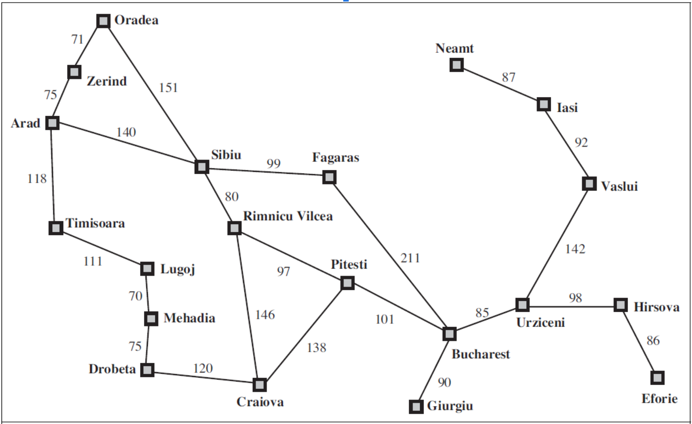
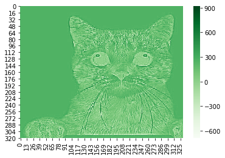
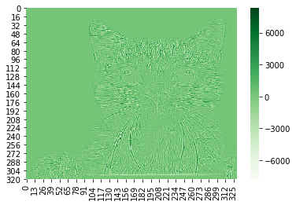

# Homework Expectations  
* Homeworks need to be submitted through Canvas
* All programming homeworks must be completed in Python programming language
* You are strongly encouraged to use online compilers such as Google Colab (Jupyter Notebooks) or https://repl.it/
* You are responsible for submitting a program that "RUNS"; You will automatically receive a 0 or very low points for a submission that does not run
* All programming homework submissions must include a screenshot of the output; submissions without screenshot may receive a 0

# Homeworks  
## Programming Homework 1 (Chapter 3)  
With your choice of programming language, implement the Breadth First Search algorithm, to find solution for the Romania route finding problem, i.e. find the shortest path to reach Bucharest from Arad.  
 

## Homework 2 (Chapter 4)
For the following game tree, show which nodes/sub-tree will be pruned by the Alpha-Beta pruning algorithm. Assume that the nodes are processed from left to right. Note that this is not a programming homework. You can solve it in paper, take a picture, and submit it at Canvas.  


## Programming Homework 3 (Chapter 22) 
A search query “Word1 Word2” is being scored against the following documents (see table). The document corpus (as shown in the table) only contains five documents. The number of times the words “Word1” and “Word2” appear in each of the documents is given in the table. The length of each document is also given. Assume k = 1.2 and b = 0.75. Write a (Python preferably) program to calculate the BM25 score for the query against all the documents and rank the documents by their BM25 score. Your program should read the table from a file, i.e. do not hardcode these values into your program. You may hardcode the values of k and b, but compute IDF, DF, TF, N, L, etc. using the data you read from the text file, at runtime. The scores you will obtain will range from -2.3 to -4.8. Note: You may get negative scores because of N being close to DF - you can read more [here](https://en.wikipedia.org/wiki/Okapi_BM25).  


## Programming Homework 4 (Chapter 22) 
Given the number of web pages N = 3, and the damping parameter d = 0.7. For the network shown below, calculate the PageRank of the pages A, B, and C. Links between the pages are shown in the graph itself. Write a program to iteratively obtain the final page ranks. Submit your code and screenshots of output.


## Programming Homework 5 (Chapter 24)  
The task here is to detect edges in an input image. The file `one-channel.csv` is one channel of the cat image we discussed in class. With `one-channel.csv` as input, complete the `convolution2D()` subroutine in the code below to get output shown. You will need to multiply each input pixel (3x3 neighbor grid) of the input 2D array `image2D` with the input filter `kernel3x3` to obtain the output 2D array `convolved2D`. Submit the screenshot of your code and screenshots of your ouptputs.

```python
from google.colab import files
import matplotlib.pyplot as plt
import seaborn as sns

files.upload() # For Google Colab

def convolution2D(image2D, kernel3x3):
  
  
  # Write your code here
  
  
  return convolved2D

image2D = np.loadtxt('one-channel.csv', delimiter=',')
sns.heatmap(image2D, cmap='Greens')
plt.show()

edge_detect_filter_3x3 = np.array([[-1, -1, -1], [-1, 8, -1], [-1, -1, -1]])

# Convolve once
convolved_image = convolution2D(image2D, edge_detect_filter_3x3)

sns.heatmap(convolved_image, cmap='Greens')
plt.show()

# Convolve again
convolved_image = convolution2D(convolved_image, edge_detect_filter_3x3)

sns.heatmap(convolved_image, cmap='Greens')
plt.show()
```
  
  


