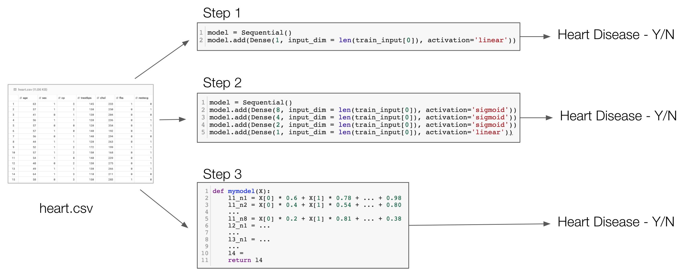

# Project Expectations
* You will work on your projects individually (i.e. group submissions are not allowed)
* Proposal, Initial Report, and Final Report must be prepared using <a href="https://www.overleaf.com/">Overleaf</a> or any other LaTeX editor.
* Your peers (that you choose) who review your report should be different from the peers who review your proposal
* Each student will review at least two and at most four proposals. Same for reports.
* Grades of Poster presentation and Final report will be average of (a) grades by the course instructor (b) peer grades, and (c) grades by external visitor/s from industry

# Project Phases
| `Phase` | `Description` | `What to Submit?` | `Submission Deadline` |
| -- | -- | -- | -- |
| Prepare Proposal | Prepare a proposal addressing the "proposal evaluation criterion" | N/A | N/A |
| Find Peers | Find at least two peers to review your proposal and Send requests to review | N/A | N/A |
| Obtain Peer Reviews | Review others' proposals referring to "proposal evaluation criterion" and Obtain peer reviews from others | N/A | N/A |
| Submit Proposal (in Canvas)| Prepare proposal along with the following: <ol><li>two set of comments from peers</li><li>your plans to address the comments</li><li>two set of your comment to your peers</li></ol> | A PDF of your Overleaf proposal | Oct  2, 2019 |
| Prepare Initial Report | Prepare a report addressing the "initial report evaluation criterion" | N/A | N/A |
| Find Peers | Find at least two peers to review your proposal and Send requests to review | N/A | N/A |
| Obtain Peer Reviews |Review others' proposals referring to "initial report evaluation criterion" and Obtain peer reviews from others | N/A | N/A |
| Submit Initial Report (in Canvas) | Prepare initial report along with the following: <ol><li>two set of comments from peers</li><li>your plans to address the comments</li><li>two set of your comment to your peers</li></ol> | A PDF of your Overleaf report | Nov 6, 2019 |
| Prepare and Submit Final Report (in Canvas) | A report (PDF) addressing all the comments received (along with rebuttals, if any) | N/A | Dec 8, 2019 (hard deadline, i.e. no extension allowed) |
| Prepare Poster | A poster highlighting the problem, diagrams, your results, plots, etc. |  N/A | N/A | 
| Present Poster and Report | Bring a printed copy of your Final Report and your Poster to the final exam | Prints | N/A | 

# Project Objectives
1. Develop a logistic regression model (for classification) or linear regression model (for regression) for a pre-cleaned tabular dataset with at least a 1000 rows and at least 3 input features (columns) using Tensorflow.
   1. Implement a Python function that serves as the model.
1. Entend the model to investigate the performance of various feedforward neural network architectures.
1. Study, investigate and discuss "what", "how", and "why" your model makes predictions.

# Proposal Evaluation Criterion
1. [1 point] Description of the dataset, its source, and motivation for the project
1. [1 point] Visualize/Plot the distribution of each input features and discuss the range of the values (min, max, mean, median, etc.)
    - For example, plot histograms showing distribution of each input features
1. [1 point] Discussion of the distribution of the output labels
    - In case of classification, check if the data is imbalanced
    - In case of regression, check if the values are uniformly distributed or not
1. [1 point] Discussion of how the data will be normalized
1. [1 point] Discussion of how the data will be split to training, validation, and test sets
1. [1 point] Discussion of what kinds of neural network architectures will be tested
1. [1 point] Discussion of how neural network models will be selected
1. [1 point] Discussion of how predictions on the test set will be evaluated
1. [1 point] Discussion of how the performance of the models will be improved
1. [1 point] Effort to document all the steps above in Overleaf
1. [2 * 2.5 points] Effort to provide clear and meaninful comments to others' proposals at least a few days before the submission deadline

# Report Evaluation Criterion
1. [1 point] Effort to study the importance of each input feature (data analysis)
    - For example, plot each input feature against output and discuss your findings
1. [1 point] Effort to compare the results of the neural network with a linear regression or logistic regression model
    - Start with a basic model and then grow your model into a multi-layered model
    - Document your performance comparison
1. [1 point] Effort to study performance difference when linear activation is used instead of sigmoid (and vice versa)
   - How does your performance change when linear activations are used instead of sigmoid, in the last neuron and all other neurons.
1. [1 point] Effort to evaluate your predictions (using Precision, Recall, MAE, MSE, etc.)
1. [1 point] Effort to code a function that represents your model
   - After your model is trained, read all the weights, and build your own function/method that serves as the model
   - Verify that predictions you obtain are same as the one you obtained using your trained model
1. [1 point] Effort to study feature importance
1. [1 point] Effort to reduce input features
1. [1 point] Effort to develop a 'reproducible' code
   - Someone else must be able to reproduce all your results
1. [1 point] Effort to document the challenges faced during the project
1. [1 point] Effort to document all the steps above in Overleaf
1. [2 * 2.5 points] Effort to provide clear and meaninful comments to others' reports at least a few days before the submission deadline

# Poster and Final Report Evaluation Criterion
Poster and Final report will be evaluated based on all the criteria above.

# Example 
Heart disease prediction using the Heart Disease UCI dataset at https://www.kaggle.com/ronitf/heart-disease-uci

Note: This is a living document and will be updated (with more details) throughout the semester. 
